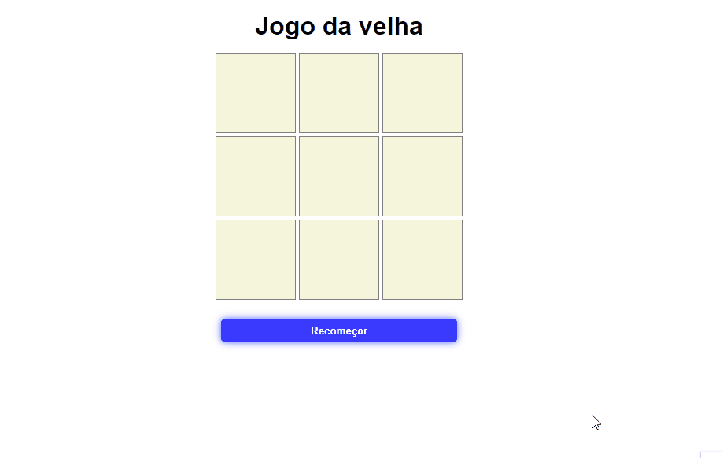

# Jogo da velha
 >Jogo da velha criado com HTML, CSS e JavaScript.

  

# Funcionalidades

### Messagem de fim de jogo

 

### Botão de recomeçar

 

----
  

## 👨‍💻Tecnologias usadas

✔ JavaScript

✔ HTML

✔ CSS

---
  